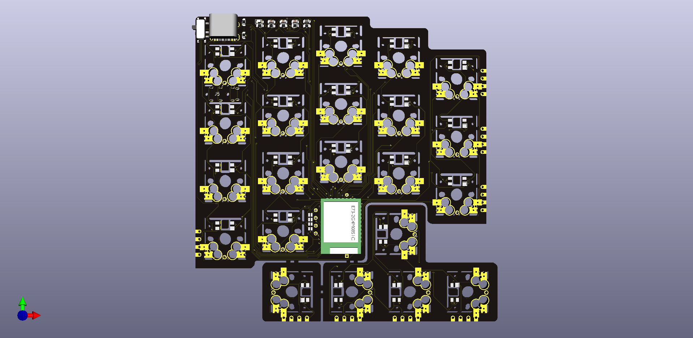

# Jorian

44-key 16-column wireless split keyboard in a 100x100 mm PCB

Please read wiki for details: https://github.com/joric/jorian/wiki

## Pictures

Development version (dual mode nRF52840-based with USB-C and battery charger onboard)

