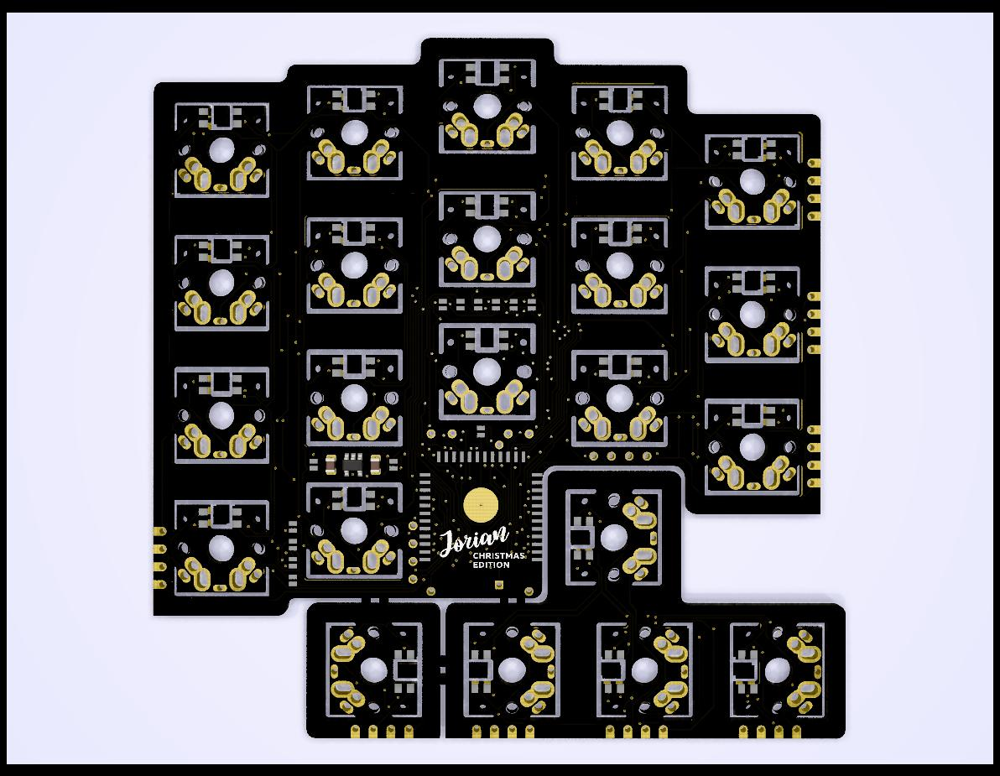

# Jorian

Ergonomic split Bluetooth keyboard

## Versions

### Version 1.0 (Revision A)

* YJ-14015 (nRF51822-CoreB), 4-pin SWD header
* Reversible I2C display (SSD1306) support
* Reversible 03962A Li-Po charger board support
* CR2032 BS-7 battery holder support
* Manufactured by Elecrow

### Screenshot

