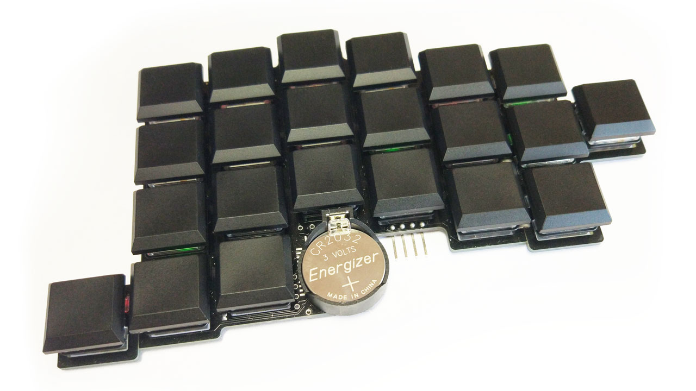

# Jorian

44-key 16-column wireless split keyboard in a 100x100 mm PCB

## Video

## Download

You may download Gerber files, schematics and precompiled QMK firmware (for the Mitosis receiver) in the [releases section](https://github.com/joric/jorian/releases).

## Firmware

You can use precompiled firmware for the halves from the original [Mitosis repository](https://github.com/reversebias/mitosis) (hardware pins are about the same):

* [precompiled-basic-left.hex](https://github.com/reversebias/mitosis/blob/master/precompiled/precompiled-basic-left.hex) (left half)
* [precompiled-basic-right.hex](https://github.com/reversebias/mitosis/blob/master/precompiled/precompiled-basic-right.hex) (right half)
* [mitosis_jorian.hex](https://github.com/joric/jorian/releases) (mitosis receiver)

For the receiver firmware (see [mitosis-hardware](https://github.com/reversebias/mitosis-hardware) repository for the schematics)
see my [mitosis-jorian](https://github.com/joric/qmk_firmware/tree/mitosis-jorian) QMK branch
that implements [Jian keymap](http://www.keyboard-layout-editor.com/#/gists/4b6c2af67148f58ddd6c6b2976c4370f) for the Mitosis keyboard.
If you don't have or don't want to use the receiver, there's also [jorian branch](https://github.com/joric/bluetosis/tree/jorian)
of my [Bluetosis](https://github.com/joric/bluetosis) firmware (mostly for the RGB backlighting)
and [nRF5x QMK fork](https://github.com/joric/qmk_firmware/tree/nrf52) (in progress, follow the updates).

### Default layout

## Hardware

### Version 1.0 (Revision A, Jorian Christmas Edition)

* 100x100mm PCB, made in KiCad, manufactured by Elecrow, $11.46 total for 10 PCBs, including shipping ([Christmas sale](http://www.elecrow.com/blog/free-prototyping-for-christmas-pcb/))
* YJ-14015 Bluetooth module (costs about $2) or nRF51822-CoreB, 4-pin SWD header for ST-LINK/V2
* RGB backlighting support (44 LEDs, SK6812mini or 3.5 mm WS2812B, I used a cheap 3535 LED strip)
* Reversible I2C display (SSD1306) support (mind that there's no much place for it if you're using a battery holder)
* Reversible 03962A Li-Po charger board support (also supports a separate SOT-23-5 3.3V voltage regulator)
* CR2032 BS-7 battery holder support (both for CR2032 or LIR2032 if you're using a Li-Po charger)
* Cherry MX, Low Profile Kailh and ALPS switches support (also can be used as a switch plate)

#### Version 1.0 issues

* Breakable parts are impossible to break accurately without incisions, need mouse bites (plate cutouts too)
* If you're soldering extra parts with solder jumpers, solder might leak through the holes to the other side
* LEDs are not flush with the PCB, probaby need 3.7x3.5mm cutouts (file the PCB if you need them flush)
* Very small gap between GND and signal pads for the switches (works fine, maybe fix in the next version)
* Li-Po charger "B-" pad overlaps the battery holder "+", might need a piece of the Kapton tape
* Li-Po charger mounting holes are about 0.1mm off (not really a problem, but should be fixed)
* LEDs are not powering up from the charger without LIR2032 (03962A has Li-Po protection but no power switching)
* **(Major issue) Li-Po charger jumpers on the back side of the PCB are really messed up (fixable with the wire)**

## License

### This work is non-commercial and prohibited for group buys. No retail, no group buys of any form.

This work is licensed under [The Non-Profit Open Software License version 3.0 (NPOSL-3.0)](https://opensource.org/licenses/NPOSL-3.0).
The keyboard layout is derived from [Jian layout](http://www.keyboard-layout-editor.com/#/gists/4b6c2af67148f58ddd6c6b2976c4370f) (just visually, there was no actual copying involved).
Please buy Jian from its author, [/u/KgOfHedgehogs](http://reddit.com/u/KgOfHedgehogs), he's running a high quality commercial batch.

## References

* Reddit thread: https://www.reddit.com/r/MechanicalKeyboards/comments/aj0mos/jorian_christmas_edition
* My nRF5x QMK fork: https://github.com/joric/qmk_firmware/commits/nrf52
* More pictures: https://imgur.com/a/ox6qtGx
